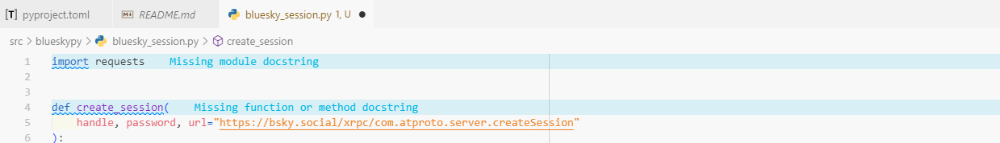
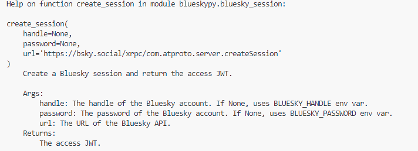
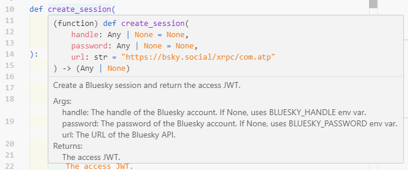

# Developing a Python package when coming from R: experience feedback

I've learned a lot by developing and contributing to various R packages over the years. Without having (yet!) a personal package on CRAN, I use package development on a daily basis and have had the chance to train several colleagues or students in this practice. Once the fear of the first package is overcome, package development in R becomes fluid, especially thanks to a well-integrated ecosystem of tools: `devtools`, `usethis`, `testthat`, `roxygen2`, etc. And if you use RStudio, the many utilities accessible with a few clicks simplify life even further.

Wanting to improve my Python skills, I wanted to see if this reassuring framework also existed in Python by creating a small package project — a way to learn through direct comparison.

**My Python experience is much more limited than my R experience, but I hope this feedback will be useful to you. Don't hesitate to point out any errors or inaccuracies!** 😀

Happy reading 🐍

---

## Development tool choice

In recent months, I've seen many messages praising the `uv` tool as a Python environment and dependency manager. If I understand correctly, `uv` replaces both `pip`, `venv`, and to some extent `poetry`. It also offers several useful shortcuts for package development.

`poetry` could have been another option, but I haven't had the opportunity to try it yet.

---

## Package creation

In R, I often use `usethis::create_package()` to create a new package.

With `uv`, you can do the same thing with the following command:

```bash
uv init blueskypy --lib
```

This creates a project structure similar to that of an R package:

```
blueskypy/
├── pyproject.toml
├── README.md
├── .gitignore
├── .python-version
└── src/
    └── blueskypy/
        ├── __init__.py
        └── py.typed
```

R developers will recognize several familiar elements:

- `README.md`: package description, installation, usage examples.  
- `.gitignore`: files to exclude from versioning.  
- `src/`: source files directory (equivalent to the `R/` folder in an R package).  
- `pyproject.toml`: metadata, dependencies, etc. (equivalent to the `DESCRIPTION` file).

Other files are specific to Python, `py.typed` and `python-version`.

---

## Version control setup

In R, I rarely use `usethis::use_git()`, preferring the command line.  
Same approach here:

```bash
git init
git remote add origin repo_url.git
git branch -M main
```

---

## Adding a function and its dependencies

To interact with the Bluesky API, I chose to use the `requests` library.

In R, I would have used `usethis::use_package()`.  
In Python with `uv`, just run:

```bash
uv add requests
```

This command updates the `pyproject.toml` file and creates a `uv.lock` file, which details all the exact dependencies of the project:

```toml
dependencies = [
    "requests>=2.32.5",
]
```

I then add my first function in `src/blueskypy/session.py` (I could not find a equivalent to `usethis::use_r()` in Python):

```python
"""Bluesky session management module"""
import requests

def create_session(
    handle=None,
    password=None,
    url="https://bsky.social/xrpc/com.atproto.server.createSession",
):
    """Create a Bluesky session and return the access JWT.

    Args:
        handle: The Bluesky handle (if None, uses BLUESKY_HANDLE env var).
        password: The password (if None, uses BLUESKY_PASSWORD env var).
        url: The Bluesky API URL.

    Returns:
        The access JWT.
    """
    # ... code ...
    return "access_jwt"
```

The documentation is here integrated in the form of a *docstring*, a concept close to `roxygen2` documentation in R (`#' @param`, etc.).

In the Cursor IDE, I use the Pylance extension, which checks for the presence of docstrings and "complains" in case of missing documentation — a feature I'd love to see in R! And Cursor allows me to complete them very quickly.



---

## Testing and reloading code

In R, I use `load_all()` almost compulsively to reload my package after each modification.  
In Python, the equivalent is "editable" installation:

```bash
uv pip install -e .
```

This makes the package available without having to reinstall it with each change.

To run a test script:

```bash
uv run script.py
```

And if you work in a Quarto notebook, you can force reloading a modified module without restarting the kernel thanks to:

```python
import blueskypy.bluesky_session
import importlib
importlib.reload(blueskypy.bluesky_session)
blueskypy.bluesky_session.create_session()  
```

This allows me to take into account code modifications in the `create_session()` function without having to restart the kernel.

This is the Python equivalent of `devtools::load_all()` in R. But I find this much heavier than in R 🫤.

---

## Documentation and vignettes

In the same way that using roxygen2 tags allows us to get a documentation page, the docstrings we used to document our `create_session()` function allow us to generate a documentation page for this function.

Natively, the documentation displays in the terminal, and it's apparently not possible to simply display the documentation in HTML format, as in an R package.



Depending on the IDE used, the documentation page can also be displayed interactively, by hovering over the function name.



---

## Adding a vignette

Vignettes are more comprehensive documentation pages than function documentation pages. In R, you can easily create a vignette with the `usethis::use_vignette()` function.

In Python, I have the impression that you need to dig into the [`sphinx`](https://www.sphinx-doc.org/en/master/) tool, which offers writing vignettes based on Markdown format (so a priori an R user wouldn't be too lost!).

---

## Internal package data

In my R projects, I'm used to using the `data-raw/` folder to insert data, and the `data/` folder for data that is included in the package. This is particularly useful for providing easily reproducible examples for package users, whether in the README, function help pages, or vignettes.

In Python, I haven't found an equivalent to these folders, but I was still able to insert data into the package by creating a function that returns data manipulable by the user.

This data contains a sample of Bluesky posts. I stored a json file in a `data/` folder present at the same level as the source code (I have the impression that Python is more permissive than R for storing files/folders in the package).

And in the end I have a `load_sample_posts()` function that allows me to load this data into the working environment.

```python
"""Data loading utilities for the blueskypy package."""

import json
from importlib.resources import files

def load_sample_posts():
    """Load sample posts from the data directory."""
    data_file = files("blueskypy") / "data" / "sample_posts.json"
    with open(data_file, "r", encoding="utf-8") as f:
        json_content = json.load(f)
    return json_content

```

---

## Debugging code

Debugging is not specific to package development, but it's an essential step in any development approach.

In R, I very often use `browser()` or `debugonce()` — two indispensable functions for understanding code behavior, especially in nested functions.

In Python, the most direct equivalent is the built-in `breakpoint()` function, which you place where you want to suspend execution.
When it's reached, the interpreter opens an interactive session (managed by the pdb module), which allows you to inspect variables, execute instructions step by step, and resume execution.


---

## Tests and checks

Unit tests are placed in a `tests/` folder, which I created manually.  
I use `pytest` to run them:

```bash
pytest tests/
```

This is the equivalent of `devtools::test()` in R.

To check code and documentation quality in a more global way, I haven't found a tool equivalent to `devtools::check()` in R. Sometimes this tool is my worst nightmare... but most of the time it's a lifesaver!

---

## Package installation

Local installation is done via:

```bash
uv pip install .
```

---

## Conclusion

As an R developer, I wasn't completely lost when developing a Python package.  
The logic of structure and organization remains quite similar, even if the practice differs.

A few points seemed less fluid to me:

- Documentation: in R, `roxygen2`, vignettes and `pkgdown` form a formidably efficient ecosystem.  
- The `load_all()`: Python requires a bit more gymnastics between `reload()` and "editable" environments.  
- The `devtools::check()`: I haven't found a tool as complete and integrated.

But overall, this experience allowed me to better understand the Python world, and to realize how much R has managed to make package development simple, integrated and coherent.

**The package sources are available [here](https://github.com/ymansiaux/blueskyPy_article). (with a bit more functions than presented in the article)**

Again, don't hesitate to point out errors I may have made, or to guide me on the things I had more difficulty with!

Thank you all!
